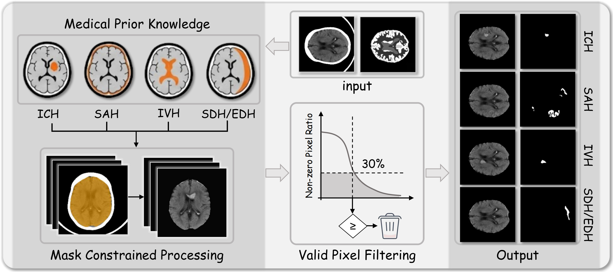
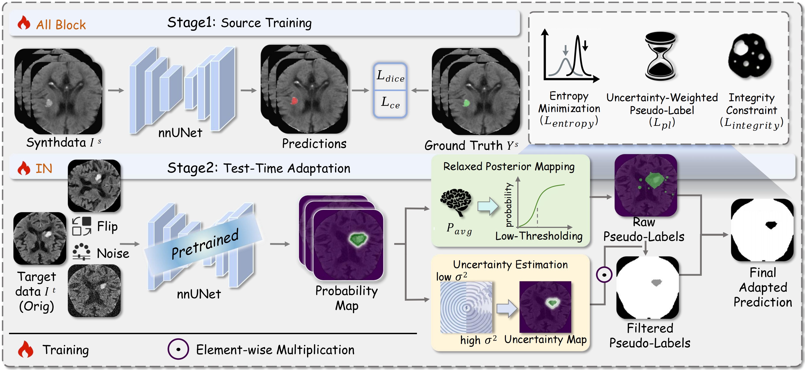
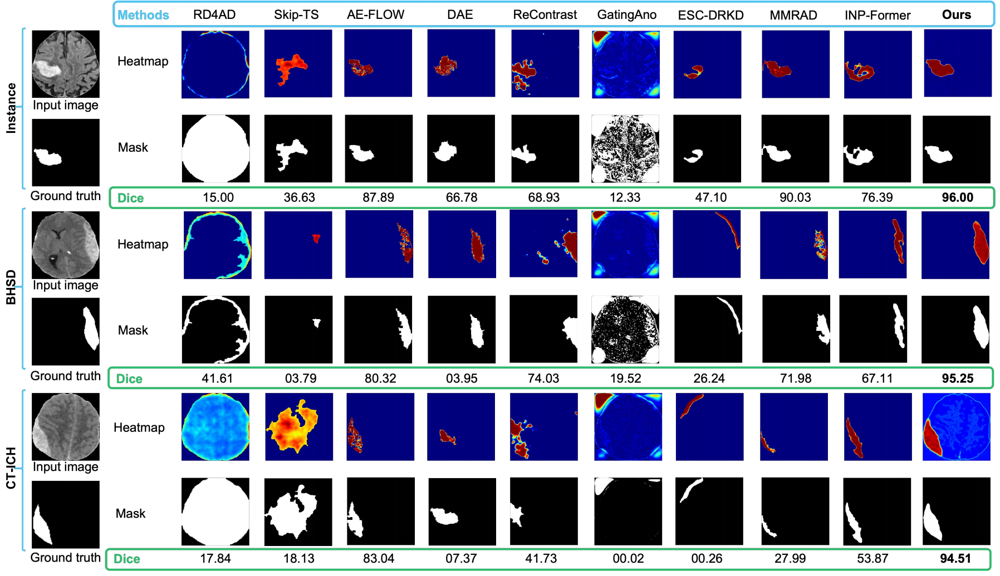
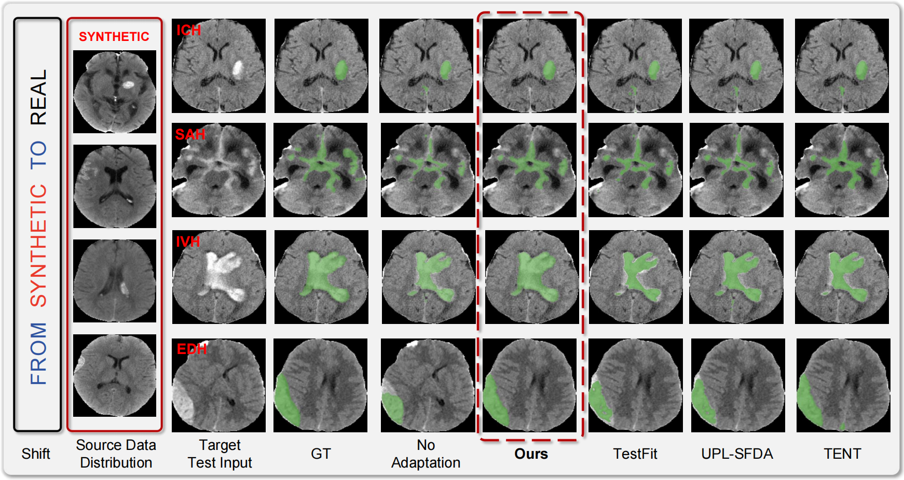

# MUIT-TTA: Annotation-Free Intracranial Hemorrhage Segmentation via Pseudo-Anomaly Synthesis and Test-Time Adaptation

[](https://github.com/JustlfC03/MUIT-TTA/stargazers)
[](https://github.com/JustlfC03/MUIT-TTA/network/members)
[](https://JustlfC03.github.io/MUIT-TTA/) 

This repository provides the PyTorch implementation of the paper **"MUIT-TTA: Annotation-Free Intracranial Hemorrhage Segmentation via Pseudo-Anomaly Synthesis and Test-Time Adaptation"** (Under Review in *Pattern Recognition*). 

Our method maintains robust and accurate annotation-free segmentation performance even under severe domain shifts between synthetic normality-based training and real clinical abnormalities. Furthermore, to eliminate the reliance on real pathological annotations, we incorporate morphological pseudo-lesion synthesis and a multi-view, uncertainty-aware, and integrity-driven Test-Time Adaptation (MUIT-TTA) strategy to systematically bridge the synthetic-to-real domain gap and mitigate target-domain noise.

---

## Proposed Method

Our framework consists of two main stages: Source-Domain Pseudo-Anomaly Synthesis and Target-Domain Test-Time Adaptation (MUIT-TTA).

<p align="center">
  
</p>

<p align="center">
  <em>
  Figure 1: Multi-subtype pseudo-anomaly synthesis framework. Generating ICH, SAH, IVH, and SDH/EDH from normal brain CTs.
  </em>
</p>

---

<p align="center">
  
</p>

<p align="center">
  <em>
  Figure 2: Overview of the MUIT-TTA framework. Integrating entropy minimization, uncertainty-weighted pseudo-labeling, and integrity constraints.
  </em>
</p>

---
## Repository Structure
```text
MUIT-TTA/
│
├── synthesize_anomalies.py     # Generates 4 pseudo-anomaly subtypes (ICH, SAH, IVH, SDH) via morphological operations
├── dataset2D.py                # PyTorch Dataset class for 2D medical images with transformations
│
├── nnunet2d.py                 # 2D nnU-Net backbone modified with Instance Normalization
├── tta_model.py                # Core MUIT-TTA adapter: Multi-view ensemble, uncertainty filtering, and integrity loss
│
├── train_source2D.py           # Core training loop, losses (Dice + CE), and evaluation metrics
├── run_training_2d.py          # Entry script for source domain pretraining
│
├── test_nnunet.py              # Standard inference and metric computation (DSC, HD95, ASSD, PPV)
├── run_tta.py                  # Entry script for Test-Time Adaptation inference
└── requirements.txt            # Environment dependencies
```
---
## Datasets

### 📌 BHSD (Train & Test)
- **Source:** [PhysioNet / GitHub](https://github.com/vlbthambawita/BHSD)  
- **Training:** Only the 2,000 non-hemorrhage (normal) samples are used to synthesize pseudo-anomalies via `synthesize_anomalies.py`.  
- **Testing:** 192 annotated hemorrhage cases are reserved for in-distribution evaluation.  

---

### 📌 INSTANCE 2022 (Test Only)
- **Source:** [Grand Challenge](https://instance.grand-challenge.org/)  
- **Usage:** 100 scans are used as an external cross-domain test set.  

---

### 📌 CT-ICH (Test Only)
- **Source:** [PhysioNet](https://physionet.org/content/ct-ich/1.3.1/)  
- **Usage:** 36 positive cases are retained as an external cross-domain test set.  

---

### ⚙️ Preprocessing

All 3D CT volumes are converted into 2D slices, where brain regions are extracted to remove surrounding background (black borders), and each slice is uniformly resized to a fixed resolution of **256 × 256** for consistent model input.

The expected data structure is as follows:

```text
data/
├── images/   # input CT slices
└── masks/    # corresponding masks
```
---

## Environment

Please ensure your environment matches the following core specifications to guarantee reproducibility:

* **Python:** 3.10
* **CUDA:** 12.1
* **PyTorch:** 2.11.0

```bash
# Create and activate conda environment
conda create -n muit_tta python=3.10 -y
conda activate muit_tta

# Install PyTorch (CUDA 12.1)
pip install torch==2.11.0 torchvision==0.26.0 torchaudio==2.11.0 --index-url [https://download.pytorch.org/whl/cu121](https://download.pytorch.org/whl/cu121)

# Install core required packages
pip install numpy==2.2.6 opencv-python==4.12.0.88 pillow==12.0.0 scipy==1.15.3 scikit-image==0.25.2 scikit-learn==1.7.2 tqdm==4.66.1 thop==0.1.1.post2209072238 matplotlib==3.10.8
```
---
## Training (Source Pretraining)

The 2D nnU-Net backbone is trained exclusively on the synthesized pseudo-anomaly source domain.  
We use the Adam optimizer with InstanceNorm2d.

### Run Training

```bash
python run_training_2d.py --train_data_dir /path/to/your_train_data --checkpoint_dir /path/to/save_checkpoints
```
---
## Inference (MUIT-TTA)

During test-time adaptation, only the affine parameters of InstanceNorm2d layers are updated.  
Evaluation metrics include **DSC, HD95, ASSD, and PPV**.

### Baseline Inference (No TTA)

```bash
python test_nnunet.py --checkpoint_path /path/to/your_checkpoint.pth --test_data_dir /path/to/your_test_data
```

### MUIT-TTA Inference

```bash
python run_tta.py \
    --checkpoint_path /path/to/your_checkpoint.pth --test_data_dir /path/to/your_test_data --steps 10 --episodic --use_pseudo_label --pseudo_label_threshold 0.25 --pseudo_label_weight 0.9 --output_dir /path/to/save_results
```

## Quantitative Results

Our MUIT-TTA framework consistently outperforms mainstream anomaly detection baselines under the strict setting of training **without real lesion annotations**.

### Performance on INSTANCE 2022 Dataset

| Method       | DSC (%) ↑ | HD95 (mm) ↓        | PPV (%) ↑        | ASSD ↓           |
|-------------|----------|--------------------|------------------|------------------|
| RD4AD       | 35.34    | 143.33 ± 137.09    | 23.37 ± 26.06    | 59.69 ± 143.75   |
| AE-FLOW     | 34.25    | 156.10 ± 139.57    | 23.25 ± 22.36    | 73.69 ± 31.85    |
| DAE         | 31.43    | 163.79 ± 153.51    | 13.70 ± 20.25    | 73.11 ± 163.47   |
| Skip-TS     | 38.63    | 193.49 ± 293.00    | 27.04 ± 27.32    | 142.49 ± 308.26  |
| ReContrast  | 48.69    | 126.13 ± 65.77     | 30.54 ± 27.45    | 83.55 ± 49.33    |
| GatingAno   | 7.13     | 63.18 ± 50.47      | 41.39 ± 38.68    | 48.12 ± 48.13    |
| ESC-DRKD    | 13.41    | 158.30 ± 40.41     | 6.99 ± 8.12      | 84.64 ± 34.05    |
| MMRAD       | 46.34    | 82.67 ± 69.03      | 52.22 ± 47.21    | 54.08 ± 59.61    |
| INP-Former  | 49.49    | 143.60 ± 57.43     | 31.81 ± 25.73    | 37.72 ± 41.77    |
| **Ours**    | **79.01**| **44.27 ± 64.32**  | **69.45 ± 34.00**| **23.09 ± 43.01**|

---

> 📌 For full results on **BHSD** and **CT-ICH** datasets, please refer to the main paper.

---

## Qualitative Results

### 1. Anomaly Localization across Datasets

<p align="center">
  
</p>

<p align="center">
  <em>
  Figure 6: Qualitative comparison of anomaly localization across INSTANCE, BHSD, and CT-ICH datasets. 
  The top row shows anomaly heatmaps, while the bottom row shows corresponding segmentation masks with slice-level Dice scores. 
  Our method effectively suppresses false positives and preserves accurate boundary structures.
  </em>
</p>

---

### 2. Cross-Subtype TTA Comparison

<p align="center">
  
</p>

<p align="center">
  <em>
  Figure 8: Qualitative comparison of test-time adaptation (TTA) methods across four hemorrhage subtypes (ICH, SAH, IVH, EDH). 
  From left to right: synthetic source samples, real target inputs, ground truth, and predictions from different methods. 
  MUIT-TTA produces more complete and structurally consistent segmentation results under domain shift.
  </em>
</p>
